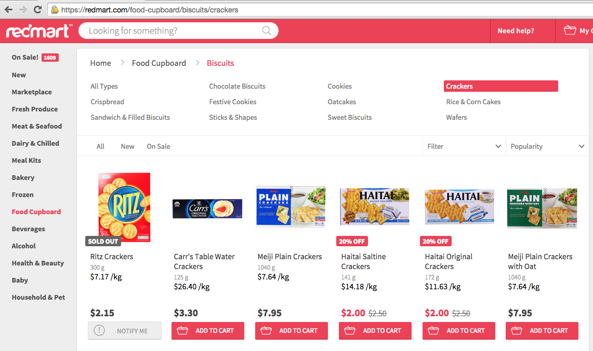

Redmart-per-kilo
================

Now available on the [Chrome Web Store](https://chrome.google.com/webstore/detail/redmart-price-per-kilo/bbnnahhoiomjaibefikkbjfefhnlfjjb).

!! Work in progress !!

This is a Google Chrome extension (my first one) that will try to add the prices per kilogram on the Redmart.com product pages.

For now it waits 5 seconds before doing the job to be sure that all the API call were done.

And it assumes that the weight is in grams. So not working for volumes, or weight in kilograms. And also lots of other situations.

# Releases:

- 2015-06-16: 382d407 Add the packaged extension
- 2015-06-15: 50e4a45 Manage weights like "8 x 50g"
- 2015-06-11: f79864c First try
