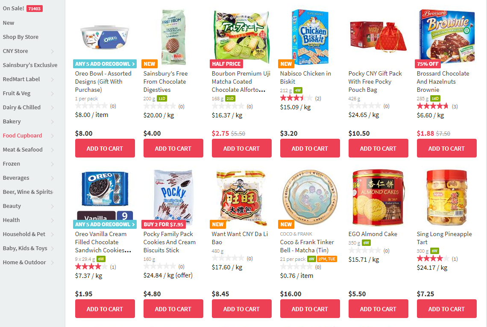

Redmart-per-kilo
================

Now available on the [Chrome Web Store](https://chrome.google.com/webstore/detail/redmart-price-per-kilo/bbnnahhoiomjaibefikkbjfefhnlfjjb).

!! Work in progress !!

This is a Google Chrome extension (my first one) that will try to add the prices per kilogram on the Redmart.com product pages.

To calculate/re-calculate the prices, click on the extension button in Chrome on the top right. You can also configure a keyboard shortcut (suggested: Ctrl + 1) to calculate/re-calculate the prices. You can do this at chrome://extensions/shortcuts. For now you will have to keep activating the extension each time you scroll down a list of products (new products are loaded dynamically) and when you navigate to another page. 

The extension handles the units g, kg, mL, L, and "per pack", and multi-buy offers in the form "Buy 5 save $3", or "Any 3 for $4". When unit prices are too small, the extension automatically multiplies it by 100 (e.g. $0.01/kg becomes $1.00/100 kg).

# Releases:

- 2019-01-27: 798680d Works with new app-based redmart site. Handles more units and offers. Now user-triggered instead of upon page load.
- 2015-06-16: 382d407 Add the packaged extension
- 2015-06-15: 50e4a45 Manage weights like "8 x 50g"
- 2015-06-11: f79864c First try
